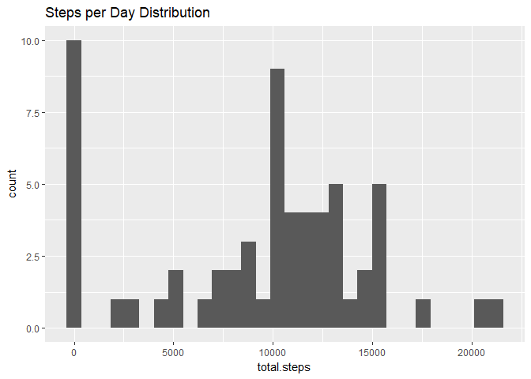
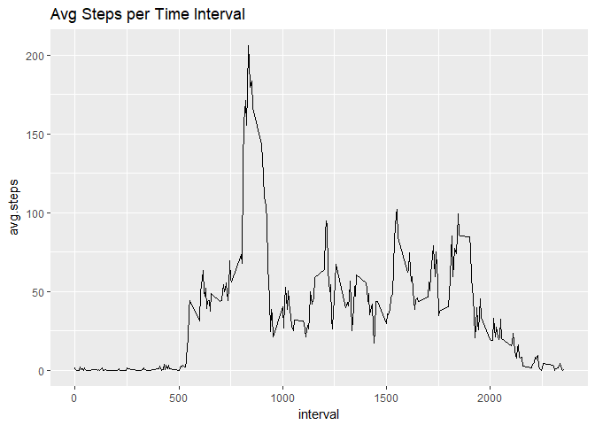
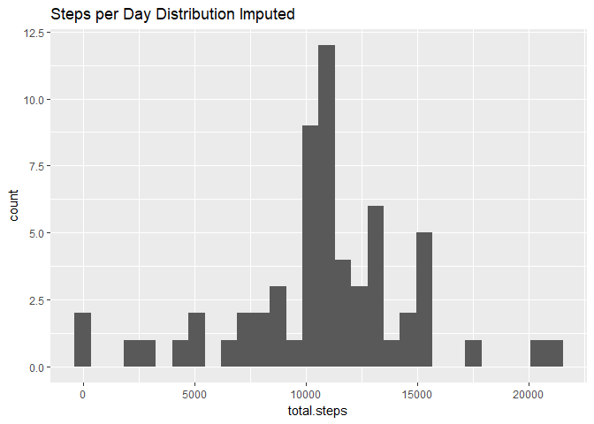
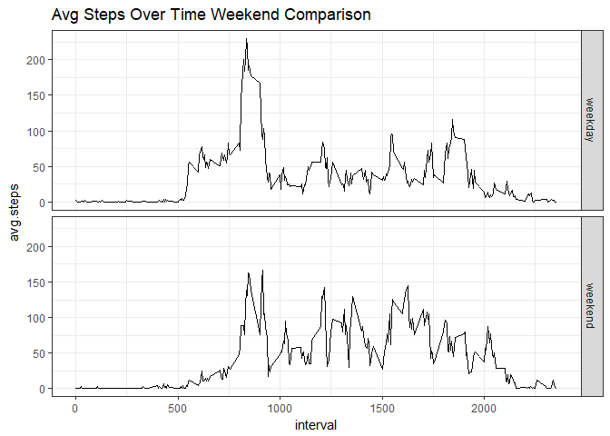

# Reproducible Research: Peer Assessment 1

Set `echo=TRUE` in global options


```r
library(knitr)
opts_chunk$set(echo = TRUE)
options(scipen=999)
```


## Loading and preprocessing the data


```r
activity <- read.csv("activity.csv")
head(activity)
```

```
##   steps       date interval
## 1    NA 2012-10-01        0
## 2    NA 2012-10-01        5
## 3    NA 2012-10-01       10
## 4    NA 2012-10-01       15
## 5    NA 2012-10-01       20
## 6    NA 2012-10-01       25
```

```r
summary(activity$steps)
```

```
##    Min. 1st Qu.  Median    Mean 3rd Qu.    Max.    NA's 
##    0.00    0.00    0.00   37.38   12.00  806.00    2304
```

```r
colSums(is.na(activity))
```

```
##    steps     date interval 
##     2304        0        0
```

```r
str(activity)
```

```
## 'data.frame':	17568 obs. of  3 variables:
##  $ steps   : int  NA NA NA NA NA NA NA NA NA NA ...
##  $ date    : Factor w/ 61 levels "2012-10-01","2012-10-02",..: 1 1 1 1 1 1 1 1 1 1 ...
##  $ interval: int  0 5 10 15 20 25 30 35 40 45 ...
```

```r
# convert date to a date object
suppressMessages(library(lubridate))
activity$date <- ymd(activity$date)
str(activity)
```

```
## 'data.frame':	17568 obs. of  3 variables:
##  $ steps   : int  NA NA NA NA NA NA NA NA NA NA ...
##  $ date    : Date, format: "2012-10-01" "2012-10-01" ...
##  $ interval: int  0 5 10 15 20 25 30 35 40 45 ...
```

```r
summary(activity$date)
```

```
##         Min.      1st Qu.       Median         Mean      3rd Qu. 
## "2012-10-01" "2012-10-16" "2012-10-31" "2012-10-31" "2012-11-15" 
##         Max. 
## "2012-11-30"
```

```r
summary(activity$interval)
```

```
##    Min. 1st Qu.  Median    Mean 3rd Qu.    Max. 
##     0.0   588.8  1177.5  1177.5  1766.2  2355.0
```


## What is mean total number of steps taken per day?


```r
# 1. Calculate the total number of steps taken per day
suppressMessages(library(dplyr))
tot_steps <- activity %>% 
        group_by(date) %>% 
        summarise(total.steps = sum(steps, na.rm = TRUE))
library(ggplot2)
# 2. Make a histogram of the total number of steps taken each day
ggplot(data = tot_steps, aes(x = total.steps)) + 
        geom_histogram() + ggtitle("Steps per Day Distribution")
```

```
## `stat_bin()` using `bins = 30`. Pick better value with `binwidth`.
```

<!-- -->

```r
# 3. Calculate and report the mean and median of the total number of steps taken per day

avg_steps <- round(mean(tot_steps$total.steps))
med_steps <- median(tot_steps$total.steps)
```
The average steps per day are: 9354  
The median steps per day are: 10395

## What is the average daily activity pattern?


```r
# 1. Make a time series plot (i.e. type = "l") of the 5-minute interval (x-axis) and the average number of steps taken, averaged across all days (y-axis)

int_steps <- activity %>% 
        group_by(interval) %>% 
        summarise(avg.steps = mean(steps, na.rm = TRUE))

ggplot(data = int_steps, aes(x = interval, y = avg.steps)) + 
        geom_line() + ggtitle("Avg Steps per Time Interval")
```

<!-- -->

```r
# 2. Which 5-minute interval, on average across all the days in the dataset, contains the maximum number of steps?

top_int <- round(int_steps[which.max(int_steps$avg.steps), ], 2)
```
The 5-min interval with the highest avg number of steps is 835, with a value of 206.17

## Imputing missing values


```r
# 1. Calculate and report the total number of missing values in the dataset (i.e. the total number of rows with NAs)

num_missing <- colSums(is.na(activity))
```
The number of missing values for each column are: 

```r
num_missing
```

```
##    steps     date interval 
##     2304        0        0
```


```r
# 2 & 3 Impute missing values. Create a new dataset that is equal to the original dataset but with the missing data filled in

activity_imp <- activity

# use for loop to replace any NA values with the mean for the interval
for (i in 1:length(activity_imp$steps)) {
        if (is.na(activity_imp$steps[i])) {
                activity_imp$steps[i] <- 
                        int_steps[int_steps$interval == activity_imp$interval[i], 2]                          %>% as.numeric()
        }
}

# 4. Make a histogram of the total number of steps taken each day and Calculate and report the mean and median total number of steps taken per day. Do these values differ from the estimates from the first part of the assignment? What is the impact of imputing missing data on the estimates of the total daily number of steps?

tot_steps_imp <- activity_imp %>% 
        group_by(date) %>% 
        summarise(total.steps = sum(steps, na.rm = TRUE))
# plot steps with imputed values
ggplot(data = tot_steps_imp, aes(x = total.steps)) + 
        geom_histogram() + ggtitle("Steps per Day Distribution Imputed")
```

```
## `stat_bin()` using `bins = 30`. Pick better value with `binwidth`.
```

<!-- -->

```r
# replot steps with missing values for comparison
ggplot(data = tot_steps, aes(x = total.steps)) + 
        geom_histogram() + ggtitle("Steps per Day Distribution with NAs")
```

```
## `stat_bin()` using `bins = 30`. Pick better value with `binwidth`.
```

<!-- -->

```r
avg_steps_imp <- round(mean(tot_steps_imp$total.steps))
med_steps_imp <- round(median(tot_steps_imp$total.steps))
```
The average steps per day are: 10766  
The median steps per day are: 10766  
The median and mean values for total daily steps are now the same. The effect of imputing the missing values unskewed the distribution by removing the majority of 0 step days


## Are there differences in activity patterns between weekdays and weekends?


```r
# 1. Create a new factor variable in the dataset with two levels -- "weekday" and "weekend" indicating whether a given date is a weekday or weekend day.

activity_imp$weekday <- weekdays(activity_imp$date)
activity_imp$weekend <- ""
for (i in 1:length(activity_imp$weekday)) {
        if (activity_imp$weekday[i] %in% c("Saturday", "Sunday")) {
                activity_imp$weekend[i] <- "weekend"
        }
        else {
                activity_imp$weekend[i] <- "weekday"
        }
}

activity_imp$weekend <- as.factor(activity_imp$weekend)

# 2. Make a panel plot containing a time series plot (i.e. type = "l") of the 5-minute interval (x-axis) and the average number of steps taken, averaged across all weekday days or weekend days (y-axis).

# create new variable with weekday/ends grouped
weekend_int <- activity_imp %>% 
        group_by(weekend, interval) %>% 
        summarise(avg.steps = mean(steps))

# plot data
ggplot(data = weekend_int) + geom_line(aes(x = interval, y = avg.steps)) +
        facet_grid(weekend~.) + theme_bw() + ggtitle("Avg Steps Over Time Weekend Comparison")
```

<!-- -->


For weekdays there is a spike where a large amount of steps occur around 8:30am, and then the amount of steps is much lower the rest of the day.  
With weekends there is no dominant spike in steps. The amount of steps are fairly evenly distributed throughout the day.
